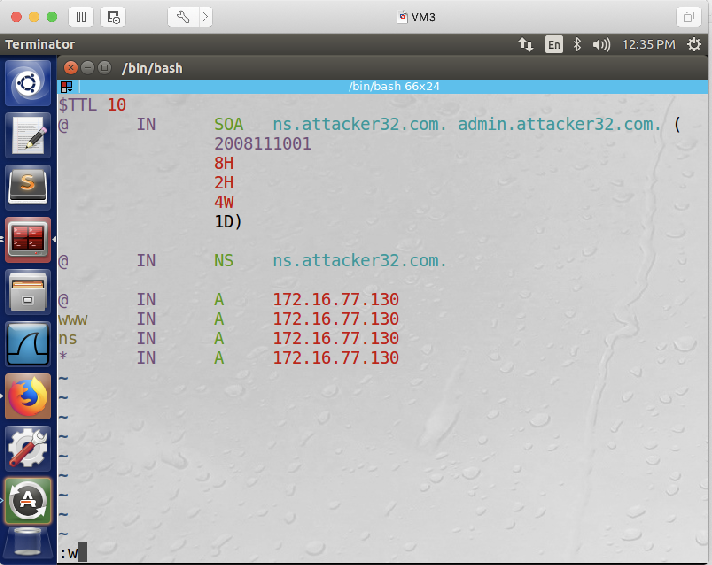

## DNS Rebinding Attack

### Requirement

In this lab, you will demonstrate the DNS rebinding attack. The goal of the attacker is, whenever the victim visits www.attacker32.com, the victim's smart thermostat's temperature will be changed to 88 Celsius degree.

### Setup

3 Linux VMs: Victim Client - acting as 2 roles, a web client, and an IoT server (www.seediot32.com), a Local DNS Server, Attacker - acting as 2 roles, a malicious web server (www.attacker32.com), and a malicious DNS serve (which is responsible for the attacker32.com domain).

The following is the IP addresses for the VMs used in this README.

| VM  |  IP Address   |                          Role                                         |
|-----|---------------|-----------------------------------------------------------------------|
| VM1 | 172.16.77.128 |   victim client, also runs an IoT server                              |
| VM2 | 172.16.77.129 |   victim server, acts as a local DNS server                           |
| VM3 | 172.16.77.130 |   attacker, runs a malicious web server, and a malicious DNS server   |

### Steps

1. on the attacker VM, set up the attacker web server:

1.1. install a web framework called Flask.

```console
$ sudo pip3 install Flask==1.1.1
```

1.2. download the attacker web server code: http://cs.boisestate.edu/~jxiao/cs333/code/rebinding/attacker_vm.zip

```console
$ wget http://cs.boisestate.edu/~jxiao/cs333/code/rebinding/attacker_vm.zip
```

1.3. then start the attacker web server.

```console
$ unzip attacker_vm.zip
$ cd attacker_vm
$ sudo ./start_webserver.sh
```

The above script will start a web server and listen on port 8080.


1.4. test the attacker web server:

http://localhost:8080 (access this from the firefox browser)


2. open a new terminal window on the attacker VM, and set up the attacker DNS server:

2.1. the above attacker_vm folder contains a DNS configuration file called attacker32.com.zone, copy this file into /etc/bind. In this file, change 10.0.2.8 to the attacker VM's IP address, and change the TTL (which is the first entry in this file) from 10000 to 10, i.e., records in the cache expire in 10 seconds.

before change:


after change:


4.2. add the following into /etc/bind/named.conf (so that the above configuration file will be used):

```console
zone "attacker32.com" {
	type master;
	file "/etc/bind/attacker32.com.zone";
};
```


2.3. restart DNS server so the above changes will take effect:

```console
$ sudo service bind9 restart
```

3: at this point, from the victim client's browser, you should be able to access these 3 URLs (open 3 tabs to access these 3 URLs, and leave these tabs open):

URL 1: http://www.seediot32.com:8080

URL 2: http://www.seediot32.com:8080/change


URL 3: http://www.attacker32.com:8080/change


However, you can change the temperature from URL 2, but not URL 3, even though they run the exact same code. (Reason? SOP)

4. launch the attack:

4.1. on the attacker VM, change the javascript code on the attacker VM. It is still in the attacker_vm folder, and it's this file: attacker_vm/rebind_malware/templates/js/change.js.

change this line:

let url_prefix = ’http://www.seediot32.com:8080’

to this line:

let url_prefix = ’http://www.attacker32.com:8080’

the screenshots show the change. before change:


after change:


4.2. on the attacker VM, restart the malicious web server: press ctrl-c to stop the script start_webserver.sh (see Step 3.3), and then re-run the script.

this screenshot shows we press ctrl-c to stop the attacker web server:


this screenshot shows we then run the same script again to re-start the attacker web server:


4.3. on the victim client VM, let the victim client access web page: http://www.attacker32.com:8080/. You should be able to see a page with a timer, which goes down from 10 to 0. Once it reaches 0, the JavaScript code on this page will send the set-temperature request to http://www.attacker32.com:8080, and then reset the timer value to 10. 

4.4. on the attacker VM, open this file: /etc/bind/attacker32.com.zone, when the count down timer is counting from 10 to 0, change the A record for www.attacker32.com, so that it points to the IoT server's IP address.

Before change:
www IN A Attacker_VM_IP


After change:
www IN A IoT_VM_IP (remember IoT VM is also the victim client VM)


4.5. on the attacker VM, reload the configuration file so the change will take effect.

```console
$ sudo rndc reload attacker32.com
```

4.6. on the victim client VM, go back to the firefox browser and see if the temperature, within 10 seconds, is changed to 88 Celsius degree (check the URL1 page). If so, then the attack is successful.

the screenshots here show the attack is successful. the tab which shows access to www.attacker32.com:


the tab which shows access to the thermometer:

